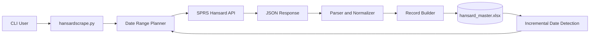

# System Architecture

## Components

- CLI/User input: selects date range and output file.
- Date Range Planner: determines effective `start_date` from CLI args and existing master file.
- Hansard API client: fetches one date at a time with timeout and status handling.
- Parser and Normalizer: converts HTML snippets inside JSON (`takesSectionVOList.content`) to clean text.
- Record Builder: maps metadata and section content into tabular rows.
- Master file writer: deduplicates by `Date`, sorts, and writes a stable Excel dataset.

## Data Flow

1. Script computes date range (`--start-date`/`--end-date`, or incremental from existing file).
2. For each date, the API is called with `sittingDate=DD-MM-YYYY`.
3. Valid responses are transformed into a normalized row schema.
4. New rows are merged with existing data, deduplicated by date, then written to Excel.